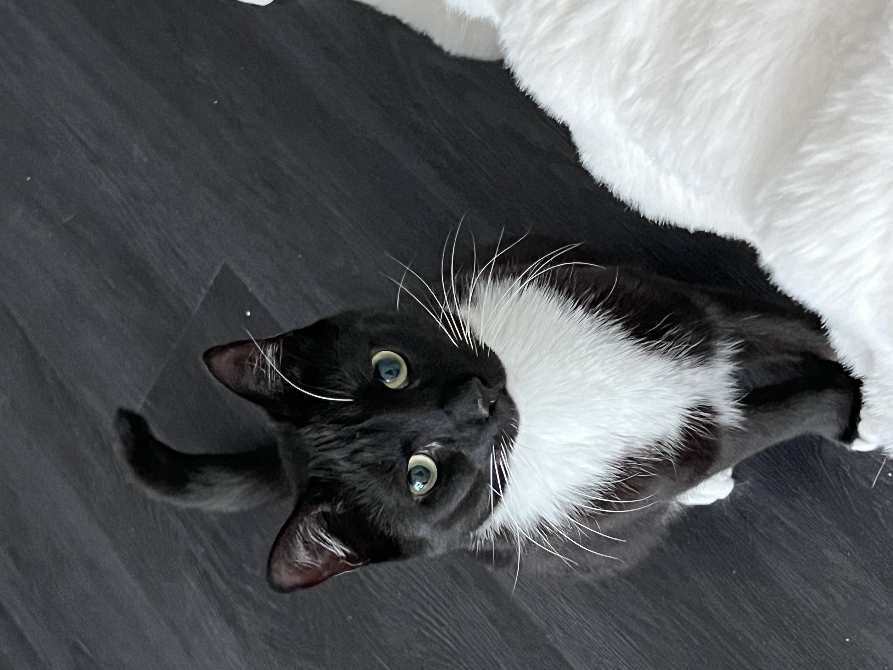

# Introduction 
Welcome!
I'm Mengyuan Chen and currently pursuing a Master of Science in Biostatistics at Columbia University. With a Bachelor’s in Statistics from Boston University, I have research experience in genetic studies and statistical modeling, aiming to apply biostatistics to healthcare advancements. I’m skilled in data analysis and programming languages like Python and R. Connect with me to explore my academic journey and professional aspirations in data science and biostatistics.

# More about me
This is my cat, Heimi:

# Personal Accounts
• [Github](https://github.com/nicolechen414)
• [Linkedin](https://www.linkedin.com/in/mengyuan-chen-577a15240/)
• nicolechencmy@gmail.com

# Link to page within the site
[Resume](resume.html)
